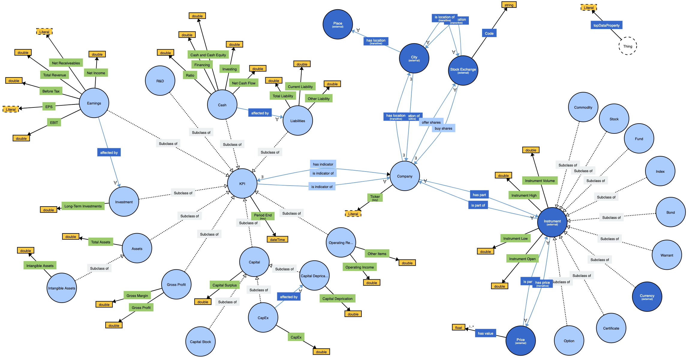

# New York Stock Exchange Ontology

Student project as part of the course [188.387 Semi-Automatic Information and Knowledge Systems](https://tiss.tuwien.ac.at/course/educationDetails.xhtml?semester=2020S&courseNr=188387) at Technical University of Vienna.

## License

- MIT